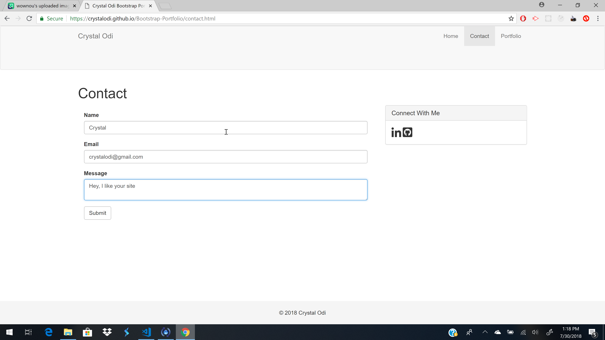
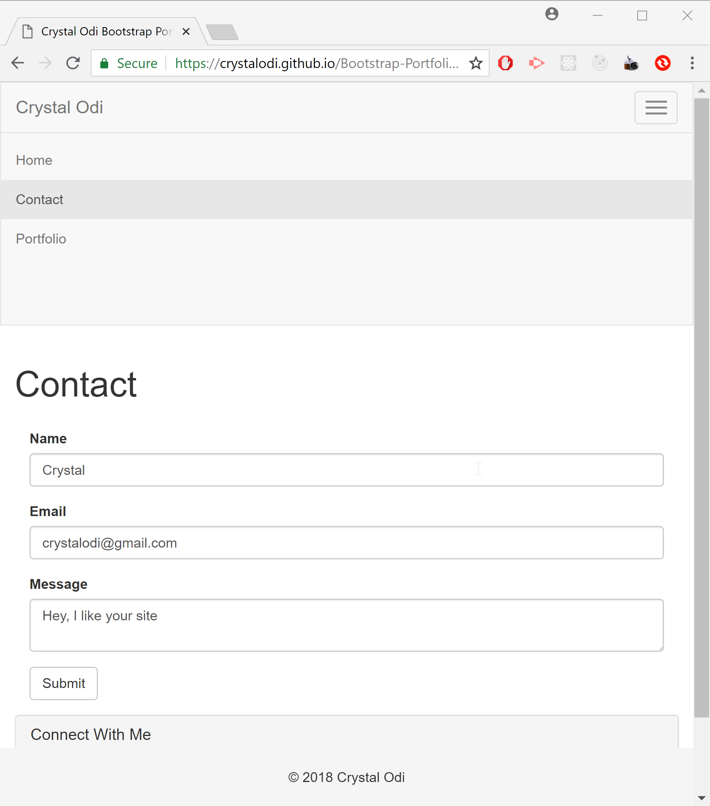
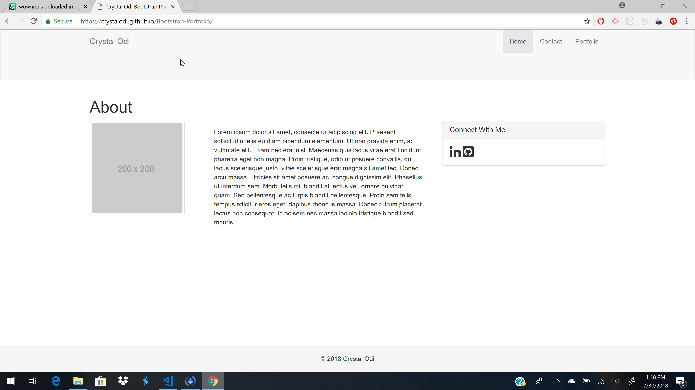
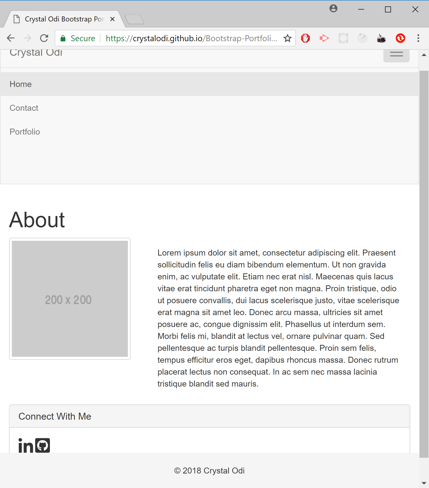
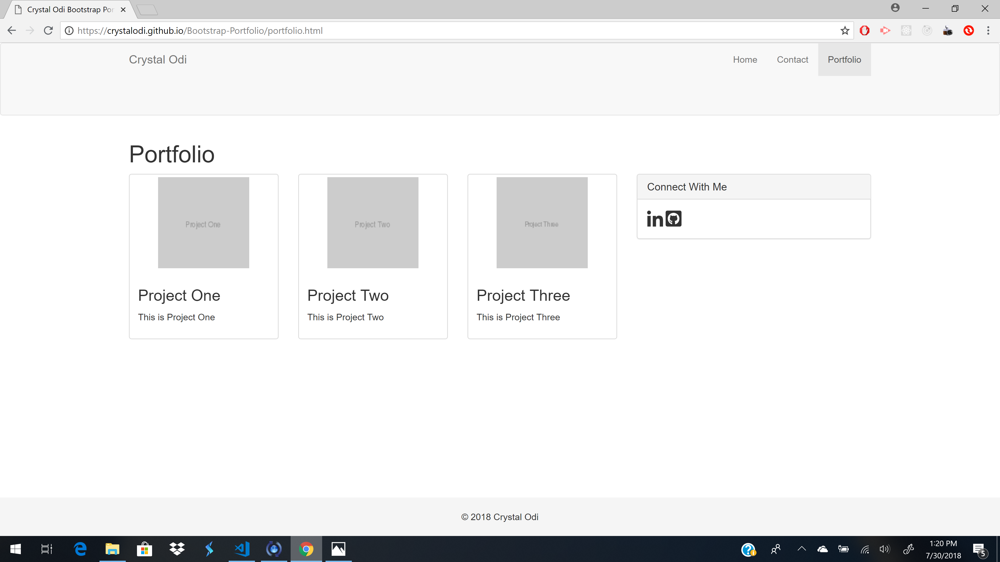
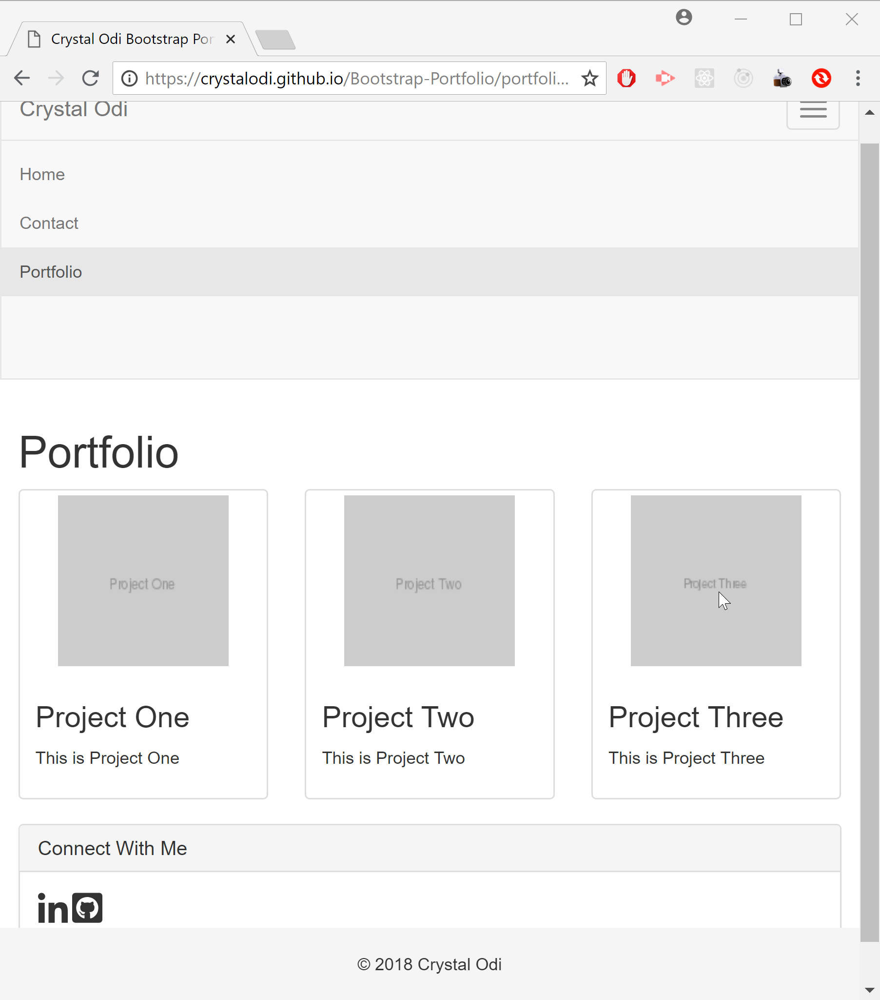

# Bootstrap Portfolio

Bootstrap Portfolio is a simple template for a web development portfolio built with the CSS framework Bootstrap 3, which is used for applying breakpoints to display the app in mobile devices. This template includes a projects page,an About page, social media section, and contact page.

## Live Version

Go [here](http://crystalodi.github.io/Bootstrap-Portfolio/) to view the app. 

## About the Application

## Getting Started

These instructions will get you a copy of the project up and running on your local machine.

### Prerequisites

Install the following programs if they aren't on your local machine.

GIT - https://git-scm.com/book/en/v2/Getting-Started-Installing-Git

### Installing

Open your terminal and clone [this](http://github.com/Bootstrap-Portfolio/Bootstrap-Portfolio.git) repository to your computer. 

```
git clone http://github.com/Bootstrap-Portfolio/Bootstrap-Portfolio.git

```

Navigate to the `/Bootstrap-Portfolio` directory with your terminal

```
cd Bootstrap-Portfolio
```

Open file explorer from the `/Bootstrap-Portfolio` directory

```
explorer .
```

Open the `index.html` file by double clicking on it. The app will open in a web browser and should look like this:


### Folder Structure
After following the instructions in the installation section, the contents of the `/Bootstrap-Portfolio` will look like this

```
│   contact.html
│   index.html
│   portfolio.html
│   README.md
│
└───assets
    ├───css
    │       stylesheet.css
```

* `assets/css/stylesheet.css` contains styling for footer so it stays fixed to bottom of screen.
* `contact.html` Contains Social media sidebar and form to contact site owner. Also contains navbar and header with name at top to navigate to other pages.
* `images` contains alternate social media icons for github and linkedIn to use in social media sidebar.
* `index.html` Contains Social media sidebar and a section for adding autobiographal and professional details. Also contains navbar and header with name at top to navigate to other pages.
* `portfolio.html` Contains Social media sidebar and a section for adding screenshots and links to other applications. Also contains navbar and header with name at top to navigate to other pages.

## Screenshots

### Contact Page
This is how the contact page looks on extra large and large screens.



On medium screens and smaller, contact page will look like this.




### About Page

This is how the about page looks on extra large and large screens.



On medium screens and smaller, contact page will look like this.




### Portfolio page

This is how the portfolio page looks on extra large and large screens.



On medium screens and smaller, portfolio page will look like this.




## Built With

* HTML
* jQuery - Used with Bootstrap Javascript to get the nav menu items to display when hamburger icon is clicked on smaller screens
* Bootstrap CSS/Bootstrap Javascript - Used for responsive design for smaller screens.

## Authors

* **Crystal Odi** - *Initial work* - [crystalodi](https://github.com/crystalodi)


## Acknowledgments

* w3Schools CSS Documentation
* Bootstrap 3 documentation


